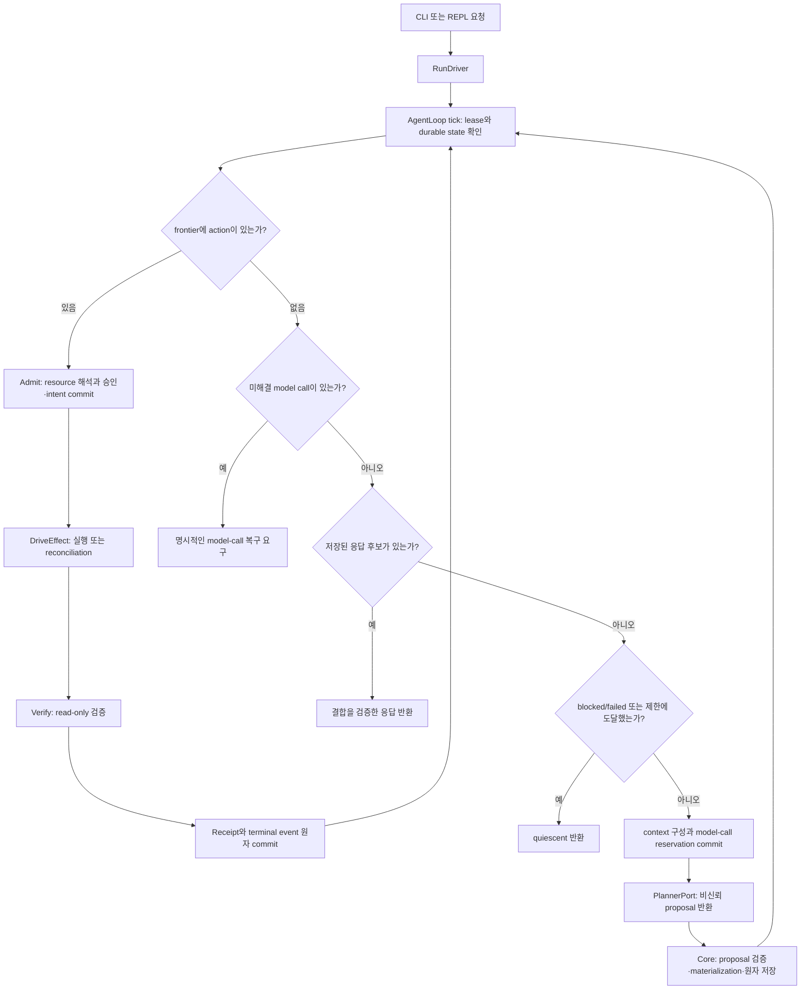

# xgen 실행 책임 경계와 다른 하네스·workflow 엔진 비교

- 조사일: 2026-10-05, Asia/Seoul
- 구현 기준: `PlateerLab/xgen-cli` commit `b36133c` (PTY까지 포함한 개발 브랜치)
- 상태: 공식 문서·로컬 실행 경로 조사 완료. 외부 엔진 비교 실험은 미실행.
- 변경 분류: 범용 아키텍처 조사. 특정 고객·문서·데모의 성공 규칙을 추가하지 않는다.
- 상위 경계: [Capability Runtime](../architecture/2026-08-28-xgen-capability-runtime-v01.md), [ADR-0009](../adr/0009-single-orchestrator-and-external-harness-integration.md)
- 후속 산출물: [ADR-0050 초안](../adr/0050-frontier-first-execution-and-planning-boundaries.md), [비교 평가 계획](2026-10-05-planning-boundary-evaluation.md)

## 결론

`VERIFIED`: xgen은 이미 frontier-first 실행 구조다. 저장된 WorkGraph에서 실행·복구·검증할 작업을 먼저 선택하고, 그런 작업이 없을 때 모델을 호출한다. “모델이 계획하고 엔진이 실행하는 구조를 새로 도입한다”는 설명은 현재 구현과 맞지 않는다.

`INFERENCE`: 현재 구조를 유지하면서 계획의 크기와 모델 판단이 필요한 경계를 측정하는 것이 첫 선택이다. 독립 엔진이라는 이유로 전체 계획 선확정이나 병렬 scheduler를 먼저 도입할 근거는 없다. 입력이 이미 알려진 여러 작업과, 관찰 뒤 다음 입력을 결정하는 작업을 구분해야 한다.

차별화 후보는 승인·실행·검증·Receipt를 같은 durable 사실에 결합하는 계약과 별도 서버 없는 로컬 배포의 조합이다. DAG, 모델/실행 분리, checkpoint, 재개 자체는 이미 다른 시스템에도 있다. 코딩 정확도·비용·사용성의 경쟁 우위는 `UNKNOWN`이다.

## 근거의 범위

`VERIFIED`는 코드·공식 문서·논문에서 직접 확인한 사실, `RECALCULATED`는 공개 숫자나 로컬 검증의 재계산, `AUTHOR_CLAIM`은 독립 재현하지 않은 저자 결과, `INFERENCE`는 프로젝트 적용 판단, `UNKNOWN`은 확인하지 못한 부분을 뜻한다.

외부 제품은 조사일의 공식 문서 계약을 비교했다. 모든 버전의 내부 구현이나 기능 부재를 증명한 감사가 아니다. 문서에 xgen과 같은 Receipt 계약이 명시되지 않았다는 사실을 “그 제품은 구현할 수 없다”로 해석하지 않는다. 논문은 방법·주요 평가표·관련 부록을 중심으로 확인했으며, 전체 논문·데이터·코드의 재현성 감사 완료를 주장하지 않는다. 최신 연구 전체를 망라한 survey도 아니다.

개발 브랜치에 있는 검색·PTY를 배포판 기능으로 표현하지 않는다. 기존 연구의 [durable 실행 근거](2026-08-28-durable-agent-runtime-evidence.md)와 [평가 프로토콜](2026-08-28-runtime-evaluation-protocol.md)을 보완하며, memory나 원격 실행의 기존 gate를 대체하지 않는다.

## 현재 xgen의 실제 흐름

그림은 주요 분기다. budget·catalog·profile·context 제한과 provider failure 처리는 각 코드 경계에서 추가로 검사한다. Plan commit은 실행 승인이 아니며, 각 concrete invocation은 admission을 거쳐야 한다.

| 책임 | 실제 소유자 | 확인한 코드 |
|---|---|---|
| 다음 durable action 선택 | Core `AgentLoop::tick`와 derived frontier | [agent_loop.rs](../../crates/xgen-runtime/src/agent_loop.rs), [frontier.rs](../../crates/xgen-runtime/src/frontier.rs) |
| 자연어 판단·계획·최종 텍스트 제안 | `PlannerPort` 구현체 | [PlannerPort와 PlanProposal](../../crates/xgen-runtime/src/agent_loop.rs) |
| 실행 흐름 연결과 pause | trusted host `RunDriver` | [driver.rs](../../crates/xgen-cli/src/driver.rs) |
| resource 해석·정책 승인·intent | Admission와 Permission broker | [admission.rs](../../crates/xgen-runtime/src/admission.rs) |
| 외부 실행과 unknown reconciliation | DirectExecutor와 exact-bound adapter | [executor.rs](../../crates/xgen-runtime/src/executor.rs) |
| 실행 evidence 검증·Receipt 확정 | Core와 host가 등록한 verifier | [verification.rs](../../crates/xgen-runtime/src/verification.rs) |
| journal·projection·sidecar 원자 저장 | embedded SQLite RunStore | [local store](../../crates/xgen-local-store/src) |
| 화면 표시·사용자 입력 | CLI/REPL frontend | [repl.rs](../../crates/xgen-cli/src/repl.rs) |

### 이미 있는 것

- `AgentLoop::tick`에서 `derive_frontier`와 `next_action`이 `planner.plan`보다 앞선다. `tick` 자체가 tool을 실행하지 않고, Driver가 admission·executor·verifier를 호출한다.
- 한 proposal에 여러 `ProposedPlanStep`과 dependency를 저장할 수 있다. 계획과 material-reference sidecar는 한 transaction으로 commit한다.
- 모델 호출 전 reservation을 저장한다. 미해결 call은 일반 resume에서 자동 재호출하지 않으며, 명시적인 discard도 사용한 budget을 환불하지 않는다.
- Receipt-bound completion을 dependency 해제에 사용한다. 성공 evidence 이후 검증·Receipt commit이 끊겨도 effect를 다시 실행하지 않고 검증을 재개하는 경로가 있다.
- 다음 모델 호출의 PlanningContext에는 확정된 typed tool output을 넣는다. 전체 transcript를 실행 정본으로 삼지 않는다.

### 실제 제한

1. **순서 dependency와 데이터 전달은 다르다.** `PlanDependency`는 Step 참조만 표현한다. `arguments`는 계획 시 schema 검증·정규화·materialization되는 JSON이다. 선행 output의 JSON Pointer를 후행 input에 연결하는 공통 계약은 없다. 특정 adapter 내부의 자체 계산 가능성과는 구분한다.
2. **실행은 현재 직렬이다.** `next_action` 하나를 처리한 뒤 frontier를 다시 계산한다. 독립 branch가 있어도 병렬 worker scheduler가 있다는 뜻은 아니다.
3. **재계획은 자유로운 graph 교체가 아니다.** 기존 Step dependency는 immutable이며 새 계획을 추가한다. 실행 가능 frontier가 먼저 소진되고, failed/manual/blocked 상태는 quiescence 조건이다. 실패한 가지의 descendants는 차단되지만 독립된 branch의 action은 남아 처리될 수 있다. 따라서 한 batch가 전체 원자 실행이나 첫 실패 시 모든 sibling 중단을 뜻하지 않는다. 실패한 가지를 모델이 자동 수정·대체하는 일반 계약은 없다. Tool output에 실패 정보가 있지만 Step 자체는 정상 검증 완료한 경우와 구분한다.
4. **provider-neutral과 Run 도중 모델 변경은 다르다.** CLI manifest가 모델과 request profile을 고정하고, resume에서 profile 결합을 확인한다. 같은 Run의 무조건적인 모델 교체·fallback은 제품 보장이 아니다. [composition.rs](../../crates/xgen-cli/src/composition.rs)의 `manifest.model()`과 `model_profile` 검사를 확인했다.
5. **검증은 선언된 계약만큼 강하다.** schema·digest·postcondition 증거의 일관성을 확인하는 것이 모든 자연어 주장이나 사용자의 목표 달성을 증명하지는 않는다. Host adapter/verifier는 trusted computing base이며 hostile OS sandbox나 외부 effect의 물리적 exactly-once를 제공하지 않는다. [ADR-0012](../adr/0012-core-verification-and-execution-receipt.md).

초기 WorkGraph 문서의 “autonomous loop 미지원” 같은 문장은 작성 당시의 범위다. 후속 AgentLoop 구현이 있으므로 현재 기능 판정에는 코드와 후속 ADR을 우선했다.

## 다른 엔진과 같은 책임 기준으로 비교

아래는 직접 대체 가능한 제품만의 비교가 아니다. Codex·Claude SDK는 완성된 agent loop를 임베딩하고, LangGraph·Temporal·Restate는 애플리케이션의 제어 흐름을 구성하는 실행 기반을 제공한다.

| 대상 | 결정과 상태의 기본 단위 | 재개·외부 effect의 경계 | xgen에서 얻는 판단 |
|---|---|---|---|
| Codex SDK / app server | runtime이 agent turn을 수행하고 client가 thread·turn·item API를 사용 | thread resume, 승인 요청과 streamed event 제공 | UI/runtime 분리는 이미 존재한다. API만으로 모든 tool의 외부 effect 복구 계약을 단정할 수 없다. [S1, S2] |
| Claude Agent SDK | Claude Code loop가 도구 결과를 받고 다음 행동을 선택, session이 대화를 보존 | permissions/hooks와 resume 제공. file checkpoint는 추적 대상 도구가 제한됨 | 승인·재개는 공통 기능이다. 대화 복원, 파일 되감기, 외부 effect reconciliation은 따로 평가해야 한다. [S3–S6] |
| LangGraph Functional API | 개발자가 entrypoint/task와 실행 흐름 정의, checkpointer가 결과 보존 | 완료 task 결과 복원. 시작했지만 완료하지 않은 task는 다시 실행될 수 있어 idempotency 필요 | durable state 자체가 고유 차별점은 아니다. 공정한 비교에는 task 분리와 idempotency 적용이 필요하다. [S7] |
| Temporal | Workflow code와 Event History, Worker가 Activities 실행 | history와 commands 대조. timeout/retry 정책 및 Activity idempotency 필요 | 장기 timer·분산 worker가 필요하면 기존 엔진을 활용할 선택지가 있다. workflow replay가 sink의 중복 방지를 대신하지 않는다. [S8–S10] |
| Restate | handler 실행과 execution log, durable step에 결과 저장 | `ctx.run` 결과를 보존하고 오류 시 설정된 정책으로 retry | LLM 호출도 durable step으로 감쌀 수 있다. self-contained 서버를 따로 실행하는 배포와 xgen의 프로세스 내 저장을 구분한다. [S11, S12] |
| 현재 xgen | RunJournal에 결합한 WorkGraph·intent·tool output·Receipt | exact admission binding, unknown 보존, verifier와 Receipt 기반 종결 | 승인·실행·검증의 결합과 local-first 구성은 후보 강점이다. 보수적인 중단이 완료율·복구 노력에 주는 비용도 측정해야 한다. |

Codex나 Claude가 항상 blind retry한다는 주장은 하지 않는다. Temporal·Restate를 쓰면 무조건 안전하다는 주장도 하지 않는다. 외부 effect에 대한 각 adapter의 idempotency·reconciliation 구현을 같은 조건으로 비교해야 한다.

## 계획·재계획 연구의 적용 범위

| 후보 | 직접 확인한 방법 | 현재 xgen 판단 | 검토 범위 |
|---|---|---|---|
| ReAct, ICLR 2023 | 환경 관찰과 reasoning/action을 교대로 사용하고 다음 행동을 조정 | `ALREADY_PRESENT`: 관찰 후 다음 계획 생성. `DO_NOT_ADOPT`: 매 tool 사이 모델 호출을 필수 규칙으로 고정 | v3 방법 §2와 주요 결과 Table 1; 모든 모델·과제에서 이긴다는 근거는 없음. [P1] |
| LLMCompiler, ICML 2024 | planner가 dependency graph를 만들고 fetching unit이 결과 변수 치환, executor가 병렬 실행. 결과에 따라 replanning | `ALREADY_PRESENT`: 계획/실행 분리. `ADOPT_WITH_GATES`: typed output→input 전달 검토. 병렬 실행은 후속 gate | §3, Table 1–2, Appendix B/D/E/H와 공개 scheduler/parser 일부. [P2, P3] |
| PlanBench, NeurIPS 2023 Datasets and Benchmarks | 목표 달성과 상태 변화의 실행 가능한 평가를 제안 | `ADOPT_WITH_GATES`: 독립적인 최종 상태 oracle 원칙 참고. 현재 모델 성능 수치의 직접 적용은 하지 않음 | 후보 탐색 단계. 이번 조사에서 전체 PDF·코드 감사는 하지 않음. [P4] |

`VERIFIED`: LLMCompiler의 “계획/실행 분리”만 채택해 고유 아키텍처라고 표현할 수 없다. `a00c9d35507507da70e8c637eee64efc8c1857ae`의 `task_fetching_unit.py`는 task 완료 이벤트로 준비 작업을 찾고, `_replace_arg_mask_with_real_value`가 `$id` 문자열을 관찰값으로 치환한다. `output_parser.py`는 argument에서 dependency를 추출한다. 이 문자열 치환을 xgen의 권한·material binding에 그대로 이식하지 않는다. [P3]

`INFERENCE`: xgen에서 데이터 전달을 도입한다면, Receipt-bound source output의 특정 JSON Pointer와 destination input의 타입을 명시하는 bounded 계약을 먼저 설계해야 한다. Concrete resource는 값이 확정된 뒤 해석하고 승인해야 한다. Output text가 새 도구나 권한을 만들 수 있어서는 안 된다. 새로운 materialization 시점·digest·resume 의미가 필요하므로 단순 parser 변경이 아니다.

### 성능 수치를 그대로 채택하지 않는 이유

`AUTHOR_CLAIM`: LLMCompiler의 latency·cost 결과는 당시 모델, 선택된 benchmark, prompt와 tool 구성에 대한 저자 보고다. 현재 코딩 SDK나 xgen의 직접 비교가 아니다. Appendix D는 반복 실행과 당시 모델 구성을 기술하지만, 이번에 provider 호출·평가 dataset을 재실행하지 않았다.

`RECALCULATED`: Table 1의 GPT HotpotQA는 `7.12 / 3.95 = 1.8025`의 latency 비율을 보이지만 accuracy는 `62.00 - 62.47 = -0.47` percentage point다. 따라서 “계획형은 정확도도 항상 높다”는 결론은 성립하지 않는다.

같은 Table 1의 LLaMA-2 ParallelQA는 latency `15.47`과 `26.20`을 적으면서 speedup을 `2.27×`로 표시한다. PDF 이미지에서도 확인했으며 표의 latency 비율은 `0.5905`로 일치하지 않는다. 어느 셀이 잘못됐는지는 `UNKNOWN`이고, 해당 행의 speedup은 설계 채택 근거에서 제외한다. 이 불일치가 다른 결과 전체를 반증한다는 뜻은 아니다. [P2, p.6]

## 선택안과 권고

| 범용 선택안 | 이점 가설 | 비용·반증 조건 | 현재 판단 |
|---|---|---|---|
| A. 현재 frontier-first + 관찰 후 계획 추가 유지 | 동적 작업에 대응하고 기존 승인·복구 계약 보존 | 실제 모델이 항상 한 Step만 제안하면 batching 장점이 작음 | 기본 경로 유지 |
| B. 승인 가능한 literal 작업 묶음의 효과 측정 | 모델 왕복을 줄일 가능성 | stale input, 잘못된 순서, 추가 토큰으로 비용·정확도 악화 가능 | 다음 실험. 엔진 재작성 없이 평가 |
| C. typed output→input 연결 추가 | 값 전달만 필요한 중간 모델 호출 감소 가능 | admission 전에 concrete resource 확정, schema/version/migration·증거 결합 필요 | B 이후 데이터 의존 사례에서 gate를 통과할 때만 별도 ADR |
| D. 전체 계획 선확정·직접 병렬 scheduler 구현 | 고정 절차·독립 read에서 latency 감소 가능 | 탐색 작업의 관찰 필요성, read/write 충돌, 권한·cancel·unknown 상태 복잡성 | 첫 구현으로 선택하지 않음 |
| E. Temporal/Restate 위에서 실행 | 분산 실행·timer·운영 기능 재사용 | 서버 운영, 중복 orchestration, xgen Receipt 경계와의 접합 필요 | 로컬 기본 경로 교체 보류. 원격 요구가 생기면 별도 비교 |

권고는 `INFERENCE`다. 실제 우위를 증명한 결과가 아니다. 다음 평가는 A/B의 계획 크기와 모델 판단 경계를 비교한다. Unknown 보존과 task 완료를 별도 지표로 두며, 안전하게 멈추기만 하는 엔진을 성공률이 높은 엔진으로 보고하지 않는다.

## 확인한 로컬 근거와 검증

- `agent_loop.rs`: `AgentLoop::tick`, `terminal_quiescence`, `validate_proposal`, `materialize_plan`.
- `driver.rs`: `drive_until_pause_with_model_egress_observed`, `model_call_may_be_next`.
- `composition.rs`: resume의 `manifest.model()` 및 request profile 확인.
- [durable_agent_loop.rs](../../crates/xgen-runtime/tests/durable_agent_loop.rs)의 `memory_plan_is_atomic_redacted_and_frontier_first`, `sqlite_reopen_restores_atomic_plan_without_calling_planner`, `sqlite_reopen_marks_interrupted_reservation_unknown_without_recalling_planner`.
- 조사 중 기존 suite 실행: `cargo test -p xgen-runtime --test durable_agent_loop --locked --quiet` **34 passed**, `cargo test -p xgen-cli --test durable_driver --locked --quiet` **2 passed**. 이는 기존 계약 확인이며 외부 엔진 성능 비교가 아니다.
- 독립 검토 뒤 [persistent_frontier.rs](../../crates/xgen-workgraph/tests/persistent_frontier.rs)의 `failed_dependency_blocks_descendants_but_not_an_independent_branch`와 `manual_dependency_blocks_descendants_but_not_an_independent_branch` 원문을 확인했다. 두 regression도 별도로 실행해 **2 passed**를 확인했다.
- 큰 소스의 후보 추출에 delegate를 사용했지만 반환한 line number가 실제 파일과 달랐다. 위 실행 순서와 채택 판단은 로컬 원문을 다시 확인했다.

## 출처

제품 문서는 2026-10-05 확인 시점의 계약이며 버전 고정된 binary 비교가 아니다.

- S1: [Codex SDK](https://learn.chatgpt.com/docs/codex-sdk)
- S2: [Codex app server](https://learn.chatgpt.com/docs/app-server)
- S3: [Claude Agent SDK loop](https://code.claude.com/docs/en/agent-sdk/agent-loop)
- S4: [Claude sessions](https://code.claude.com/docs/en/agent-sdk/sessions)
- S5: [Claude permissions](https://code.claude.com/docs/en/agent-sdk/permissions)
- S6: [Claude file checkpointing](https://code.claude.com/docs/en/agent-sdk/file-checkpointing)
- S7: [LangGraph Functional API: determinism/idempotency](https://docs.langchain.com/oss/python/langgraph/functional-api)
- S8: [Temporal Workflow Execution](https://docs.temporal.io/workflow-execution)
- S9: [Temporal Activity Execution](https://docs.temporal.io/activity-execution)
- S10: [Temporal Activity Definition](https://docs.temporal.io/activity-definition)
- S11: [Restate durable steps](https://docs.restate.dev/develop/python/durable-steps)
- S12: [Restate installation](https://docs.restate.dev/installation)
- P1: Yao, Zhao, Yu, Du, Shafran, Narasimhan, Cao. [ReAct](https://arxiv.org/abs/2210.03629v3), ICLR 2023, arXiv v3 2023-03-10. [공개 코드](https://github.com/ysymyth/ReAct). PDF SHA-256 `f285b0971ae4a790e402fb93966bed3adde2cf0a04977d08b2b40d6ab0cace69`, 33 pages.
- P2: Kim, Moon, Tabrizi, Lee, Mahoney, Keutzer, Gholami. [An LLM Compiler for Parallel Function Calling](https://proceedings.mlr.press/v235/kim24y.html), ICML 2024, PMLR 235:24370–24391. [출판본 PDF](https://raw.githubusercontent.com/mlresearch/v235/main/assets/kim24y/kim24y.pdf). arXiv `2312.04511` v3는 2024-06-05이지만 수치 확인에는 이 출판본을 사용했다. PDF SHA-256 `36dde899ed8abe0df728215e054aab21d1699add719afeb0ddadbb4e4eb23263`, 22 pages.
- P3: LLMCompiler 공개 코드 commit `a00c9d35507507da70e8c637eee64efc8c1857ae`, commit date 2024-07-10. [task fetching](https://github.com/SqueezeAILab/LLMCompiler/blob/a00c9d35507507da70e8c637eee64efc8c1857ae/src/llm_compiler/task_fetching_unit.py), [parser](https://github.com/SqueezeAILab/LLMCompiler/blob/a00c9d35507507da70e8c637eee64efc8c1857ae/src/llm_compiler/output_parser.py). 논문 평가 commit과 동일하다는 증거는 확인하지 않았다.
- P4: Valmeekam, Marquez, Olmo, Sreedharan, Kambhampati. [PlanBench](https://arxiv.org/abs/2206.10498), NeurIPS 2023 Datasets and Benchmarks. 후보 평가 원칙 참고용이며 성능 수치는 인용하지 않는다.

PDF와 `paper_snapshot.py` metadata·추출 text·표 이미지의 로컬 조사 사본은 `/tmp/xgen-architecture-research-20261005-y5o0gga8`에 있다. 임시 디렉터리는 정본이나 재현의 필수 경로가 아니다. 공개 URL·version·digest로 원문을 다시 식별할 수 있다. 원문 전체는 저장소에 복사하지 않는다.
